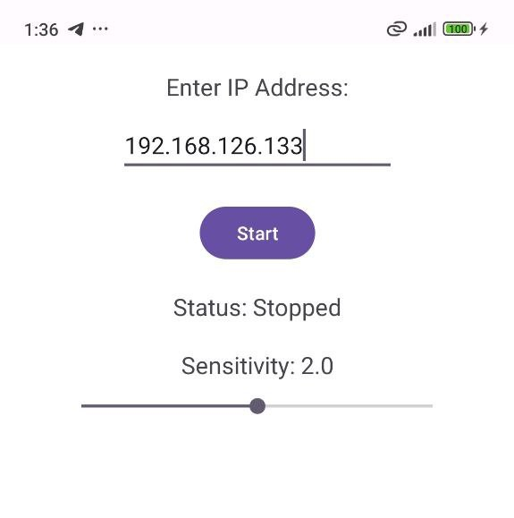

# WiFi-Controlled Car Robot (ESP32)

This project is a WiFi-controlled car robot built using an **ESP32** microcontroller. The robot is equipped with two motors controlled by an **L298N motor driver**, powered by a **lithium battery**, and controlled via a **UDP server**. It can be operated using two types of controllers:
1. A **Python desktop application** for traditional control.
2. An **Android app** that uses the phone's gyroscope for a fun and interactive driving experience.

---

## Features
- **ESP32-based UDP server**: Listens for commands over WiFi.
- **Dual motor control**: Uses L298N motor driver for precise control.
- **Two control modes**:
  - **Python desktop app**: For traditional keyboard or joystick control.
  - **Android app**: Uses gyroscope for tilt-based control.
- **Portable**: Powered by a lithium battery for wireless operation.
- **Easy to build**: Minimal components and wiring required.

---

## Components Used
- **Microcontroller**: ESP32
- **Motor Driver**: L298N
- **Motors**: 2x DC motors
- **Power Source**: Lithium battery
- **Wires**: For connections
- **Chassis**: Car robot frame
- **Controllers**:
  - Python desktop application
  - Android app (gyroscope-based)

---

## How It Works
1. The ESP32 acts as a **UDP server**, listening for incoming commands over WiFi.
2. The **Python desktop app** or **Android app** sends control commands (e.g., forward, backward, left, right) to the ESP32.
3. The ESP32 processes the commands and controls the motors via the L298N motor driver.
4. The Android app uses the phone's gyroscope to make driving more intuitive and fun.

---

## Setup Instructions

### Hardware Setup
1. Connect the **L298N motor driver** to the ESP32 and the two DC motors.
2. Power the ESP32 and motor driver using the lithium battery.
3. Assemble the car robot chassis and mount all components securely.

### Software Setup
1. **ESP32 Code**:
   - Upload the Arduino sketch (`esp32_udp_server.ino`) to the ESP32.
   - Configure the WiFi credentials in the code.
2. **Python Desktop App**:
   - Run the Python script (`desktop_controller.py`) on your desktop.
   - Enter the ESP32's IP address to establish a connection.
3. **Android App**:
   - Install the Android app (`android_controller.apk`).
   - Connect to the ESP32's IP address and use the gyroscope to control the robot.

[Watch the Demo Video](./videos/video.mp4)

---

## Code Structure
- **ESP32 Code**: Handles UDP communication and motor control.
- **Python Desktop App**: Sends UDP commands based on user input.
- **Android App**: Sends UDP commands based on gyroscope data.

---

## Future Improvements
- Add obstacle avoidance using ultrasonic sensors.
- Implement a camera for live video streaming.
- Add a web interface for control via a browser.

---

## Contributing
Feel free to contribute to this project! Open an issue or submit a pull request if you have any improvements or suggestions.

---

## License
This project is licensed under the MIT License. See the [LICENSE](LICENSE) file for details.

---

Enjoy building and controlling your WiFi car robot! 🚗🤖